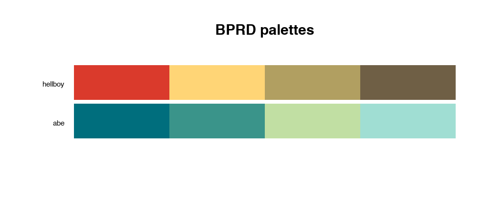
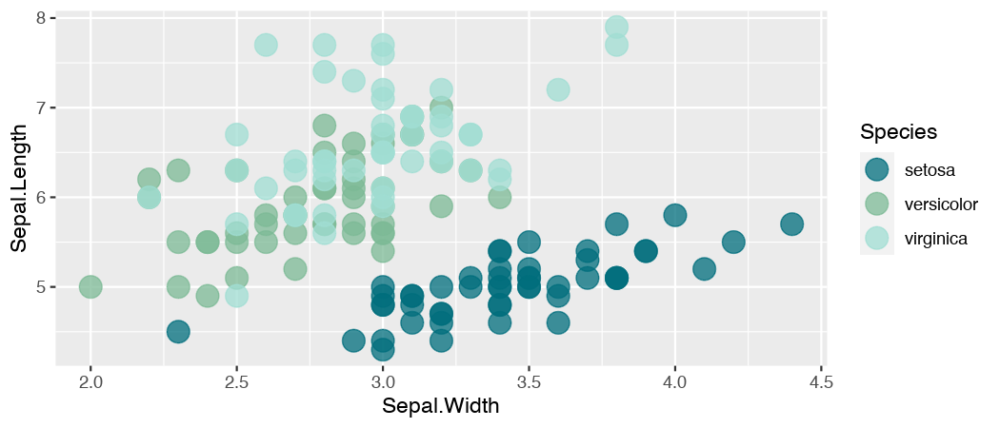
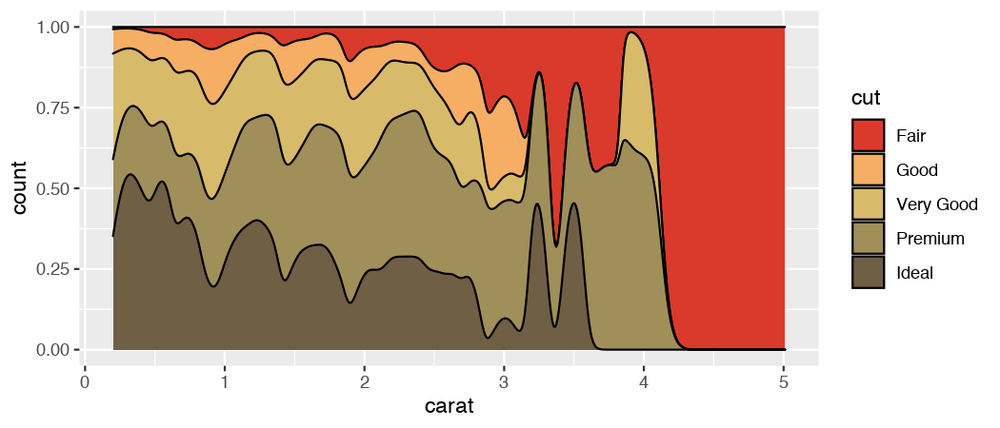
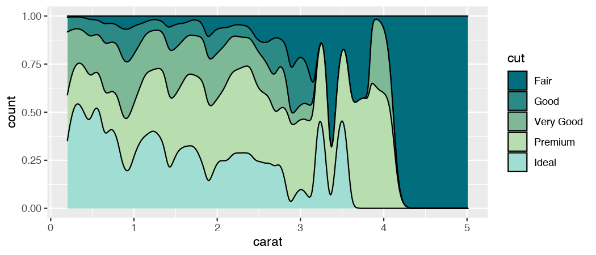
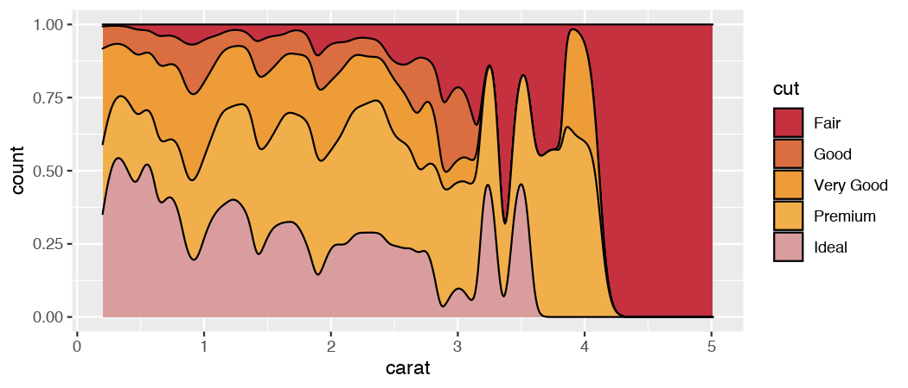
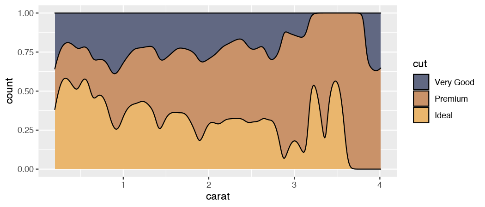
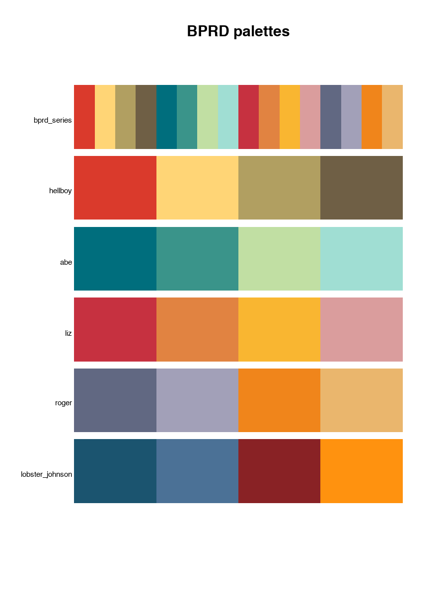

<!-- README.md is generated from README.Rmd. Please edit that file -->

# BPRDcolors

**Author:** [Michael McCarthy](https://github.com/mccarthy-m-g)

**License:** [MIT](https://opensource.org/licenses/MIT)

The `BPRDcolours` package provides a collection of color palettes based
on Star Trek. It also offers functions for custom palettes and `scale_*`
functions for use with `ggplot2`.

## Installation

Install the CRAN release of `BPRDcolours` with

``` r
install.packages("BPRDcolours")
```

Install the development version from GitHub with

``` r
# install.packages("remotes")
remotes::install_github("mccarthy-m-g/BPRDcolours")
```

## Examples

### Basics

``` r
library(BPRDcolours)
library(ggplot2)

bprd_pal("hellboy")
#> [1] "#DA3A2C" "#FFD576" "#B19F61" "#6F5F45"

bprd_pal("abe")
#> [1] "#006E7D" "#3A948A" "#C1DFA3" "#A0DED3"
```

Preview the `hellboy` and `abe` palettes.

``` r
view_bprd_pals(c("hellboy", "abe"))
```



### Scale functions for use with ggplot2

``` r
p <- ggplot(iris, aes(Sepal.Width, Sepal.Length, color = Species)) + 
  geom_point(size = 5, alpha = 0.75)
p + scale_colour_bprd() # starfleet is default palette
```



``` r

p <- ggplot(diamonds, aes(carat, stat(count), fill = cut)) +
  geom_density(position = "fill")
p + scale_fill_bprd("hellboy")
```



``` r
p + scale_fill_bprd("abe")
```



``` r
p + scale_fill_bprd("liz")
```



``` r

d <- diamonds[diamonds$cut >= "Very Good", ]
p <- ggplot(d, aes(carat, stat(count), fill = cut)) +
  geom_density(position = "fill")
p + scale_fill_bprd("roger")
```



### All predefined palettes

``` r
# See available palette names
bprd_pal()
#> [1] "bprd_series"     "hellboy"         "abe"             "liz"            
#> [5] "roger"           "lobster_johnson"

# view all predefined palettes
view_bprd_pals()
```


